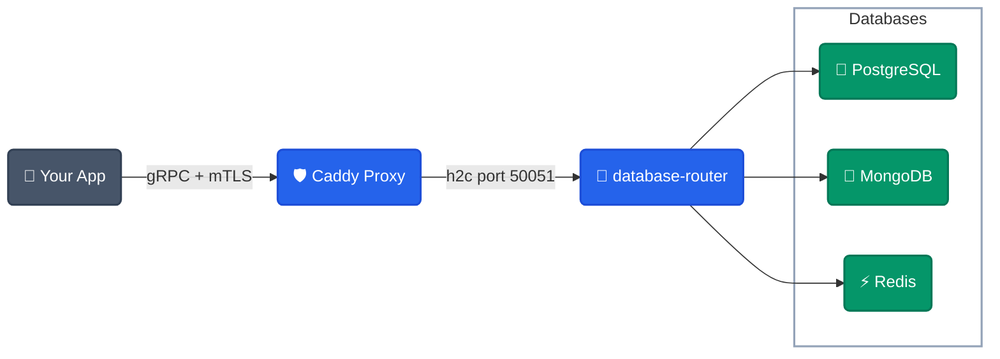

# Database Router


A lightweight, self-hosted **gRPC** server providing a unified interface for PostgreSQL, MongoDB, and Redis. It keeps database credentials out of your application code and routes traffic efficiently and securely.

---

## 📋 Requirements

Before deploying the Database Router to production, ensure you have the following prerequisites ready:

- **Docker & Docker Compose**: Must be installed on your local system or deployment server.
- **Domain Name**: You must have a registered domain name (e.g., `example.com`).
- **Cloud Provider Name Servers**: The name servers for your domain **must** be managed by your cloud provider (e.g., DigitalOcean, Cloudflare). This is required for automatic DNS management and Let's Encrypt / mTLS certificate generation.
- **Provider API Token**: You must have a valid API token from your cloud provider to allow Terraform and Ansible to automatically provision and configure your infrastructure.

---

## 🚀 Quick Start (Cloud Deployment)

The fastest way to deploy the entire stack to DigitalOcean is using our automated deployer.

**Mac / Linux:**
```bash
cd deployer
DIGITALOCEAN_TOKEN="your_token_here" docker compose up -d
```

**Windows (PowerShell):**
```powershell
cd deployer
$env:DIGITALOCEAN_TOKEN="your_token_here"; docker compose up -d
```

---

## 🏗️ Architecture



---

## 🛡️ Security & Authentication

While the core router is lightweight and delegates security to the infrastructure layer, **our automated cloud deployment is production-grade out of the box.**

The included Terraform and Ansible automation automatically secures your deployment via the provided `Caddyfile`:
- **Caddy Reverse Proxy**: Serves exclusively over port `443` and safely proxies gRPC traffic over unencrypted HTTP/2 (`h2c://`) directly to the isolated `db-router` container.
- **Strict mTLS Enforcement**: Uses `require_and_verify` client authentication. Only applications presenting a valid TLS certificate signed by your trusted Certificate Authority (`ca.crt`) are permitted to connect.
- **Network Isolation**: Cloud firewalls are configured to ensure port `50051` is tightly locked down and never exposed directly to the public internet.

---

## 📚 Documentation & Automation

Detailed guides and automation playbooks are included in the repository:

- **[gRPC API Reference](docs/api.md)** — Full RPC definitions for PostgreSQL, MongoDB, and Redis services.
- **[Configuration](docs/config.md)** — Explanations of all JSON config fields and environment variables.
- **[mTLS Guide](docs/mtls-guide.md)** — Instructions on certificate generation and mTLS setup.
- **[Terraform Infrastructure](terraform/)** — One-command cloud infrastructure provisioning.
- **[Ansible Setup](ansible/)** — Automated server configuration, proxy setup, and mTLS enforcement.
- **[Deployer](deployer/)** — A fully automated container to deploy everything with a single `docker run` command.

---

## 📄 License

MIT
