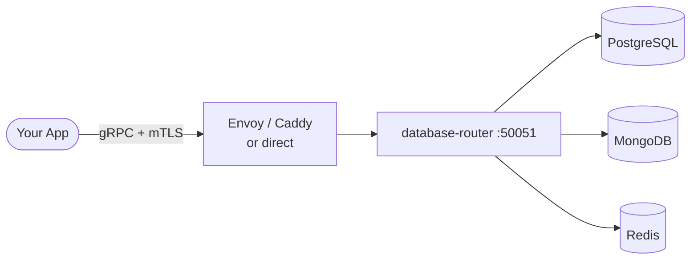
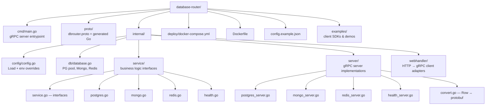

# database-router


A lightweight, self-hosted **gRPC** server that exposes a unified interface for PostgreSQL, MongoDB, and Redis. No direct database credentials in your app code.

---

## Why gRPC?

| | database-router (gRPC) | REST alternatives |
|---|---|---|
| Schema-defined contract | yes (`.proto` file) | no |
| Strongly typed clients | yes (code-generated) | no |
| Bi-directional streaming ready | yes | limited |
| Server reflection (auto-discovery) | yes (`grpcurl`, `grpcui`) | no |
| Efficient binary encoding | yes (protobuf) | no (JSON) |

---

## How it works



The router exposes four gRPC services — `PostgresService`, `MongoService`, `RedisService`, and `HealthService` — all defined in [`proto/dbrouter.proto`](proto/dbrouter.proto). Server reflection is always enabled so tools can discover services at runtime without the proto file.

---

## Quick start

**1. Copy the config template**
```bash
cp config.example.json config.json
# fill in your database host, user, password
```

**2. Run with Docker**
```bash
docker run -d \
  -p 50051:50051 \
  -v $(pwd)/config.json:/app/config.json:ro \
  --name database-router \
  ghcr.io/xeze-org/database-router:latest
```

Or with Compose:
```bash
docker compose -f deploy/docker-compose.yml up -d
```

**3. Test it with grpcurl**
```bash
# install grpcurl: https://github.com/fullstorydev/grpcurl
grpcurl -plaintext localhost:50051 list
grpcurl -plaintext localhost:50051 dbrouter.HealthService/Check
grpcurl -plaintext localhost:50051 dbrouter.PostgresService/ListDatabases
```

Or browse interactively with [grpcui](https://github.com/fullstorydev/grpcui):
```bash
grpcui -plaintext localhost:50051
```

---

## Running from source

**Requirements:** Go 1.24+

```bash
git clone https://github.com/Xeze-org/Database-Router
cd Database-Router

# Windows
start.bat

# Linux / macOS
go mod download
go build -o database-router ./cmd/
./database-router
```

Default port is `50051`. Override with `PORT=9000 ./database-router`.

---

## Configuration

Config is loaded from `config.json` in the working directory.
**Do not commit this file** — it is in `.gitignore`. Use `config.example.json` as your template.

See [docs/config.md](docs/config.md) for the full field reference and environment variable overrides.

---

## gRPC Services

All four services are documented fully in [docs/api.md](docs/api.md).

| Service | RPCs |
|---|---|
| `HealthService` | `Check`, `CheckPostgres`, `CheckMongo`, `CheckRedis` |
| `PostgresService` | `ListDatabases`, `CreateDatabase`, `ListTables`, `ExecuteQuery`, `SelectData`, `InsertData`, `UpdateData`, `DeleteData` |
| `MongoService` | `ListDatabases`, `ListCollections`, `InsertDocument`, `FindDocuments`, `UpdateDocument`, `DeleteDocument` |
| `RedisService` | `ListKeys`, `SetValue`, `GetValue`, `DeleteKey`, `Info` |

---

## Example calls

```bash
ADDR="localhost:50051"

# health check
grpcurl -plaintext $ADDR dbrouter.HealthService/Check

# list PostgreSQL databases
grpcurl -plaintext $ADDR dbrouter.PostgresService/ListDatabases

# run a raw SQL query
grpcurl -plaintext -d '{"query":"SELECT count(*) FROM users","database":"mydb"}' \
  $ADDR dbrouter.PostgresService/ExecuteQuery

# insert a row
grpcurl -plaintext \
  -d '{"database":"mydb","table":"users","data":{"name":{"string_value":"Alice"},"email":{"string_value":"alice@example.com"}}}' \
  $ADDR dbrouter.PostgresService/InsertData

# Redis set with TTL
grpcurl -plaintext \
  -d '{"key":"session:abc","value":"user:42","ttl":3600}' \
  $ADDR dbrouter.RedisService/SetValue

# find all MongoDB documents in a collection
grpcurl -plaintext \
  -d '{"database":"mydb","collection":"events"}' \
  $ADDR dbrouter.MongoService/FindDocuments
```

---

## Authentication

`database-router` has **no built-in authentication**. All traffic reaching port 50051 is trusted.

Protect it by:
- Binding to `127.0.0.1` only and using an application-level secret in your gRPC metadata
- Running behind Envoy Proxy with an ext-authz filter or JWT validation
- Using mTLS so only clients with a trusted certificate can connect

> Never expose port 50051 directly to the internet without authentication.

---

## Security

> **This router is designed for internal networks and trusted microservice environments only.**

Key risks:

- **Raw SQL RPC** — `PostgresService.ExecuteQuery` executes arbitrary SQL. Never pass user-supplied input directly. Use it for internal tooling only.
- **No built-in auth** — If port 50051 is reachable without protection every database operation is unauthenticated.
- **Credentials** — `config.json` holds database passwords in plaintext. Use `0600` permissions, never commit it, and prefer environment variable overrides in CI/CD.

**Recommended deployment:**
```
Client → Envoy (mTLS + auth) → database-router (localhost:50051)
```

---

## Project structure



---

## Examples

Client examples for connecting from your own apps live in [`examples/`](examples/):

| Language | Path | Description |
|---|---|---|
| Python | [`examples/python/`](examples/python/) | Flask app + `DbRouterClient` class calling the HTTP proxy |

---

## Docs

- [docs/api.md](docs/api.md) — full gRPC service and RPC reference
- [docs/config.md](docs/config.md) — all config fields and env vars
- [docs/deployment.md](docs/deployment.md) — Docker, source, reverse proxy setup
- [docs/mtls-guide.md](docs/mtls-guide.md) — certificate generation, per-app certs, Cloudflare setup
- [terraform/](terraform/) — one-command DigitalOcean deployment (Terraform)
- [ansible/](ansible/) — server provisioning with Docker, Caddy auto-HTTPS, and mTLS
- [deployer/](deployer/) — fully automated container: one `docker run` deploys everything (Terraform + Ansible)

---

## Regenerating protobuf code

If you modify `proto/dbrouter.proto`, regenerate the Go bindings:

```bash
# Prerequisites: protoc, protoc-gen-go, protoc-gen-go-grpc
go install google.golang.org/protobuf/cmd/protoc-gen-go@latest
go install google.golang.org/grpc/cmd/protoc-gen-go-grpc@latest

protoc --proto_path=proto \
  --go_out=proto/dbrouter --go_opt=module=db-router/proto/dbrouter \
  --go-grpc_out=proto/dbrouter --go-grpc_opt=module=db-router/proto/dbrouter \
  proto/dbrouter.proto
```

---

## Docker image

The image contains **zero credentials**. Config is always supplied at runtime via a volume mount.

Build and push is **manual only** — go to **Actions → Build & Publish Docker Image → Run workflow**.

**Architectures:** `linux/amd64`, `linux/arm64`

---

## License

MIT
