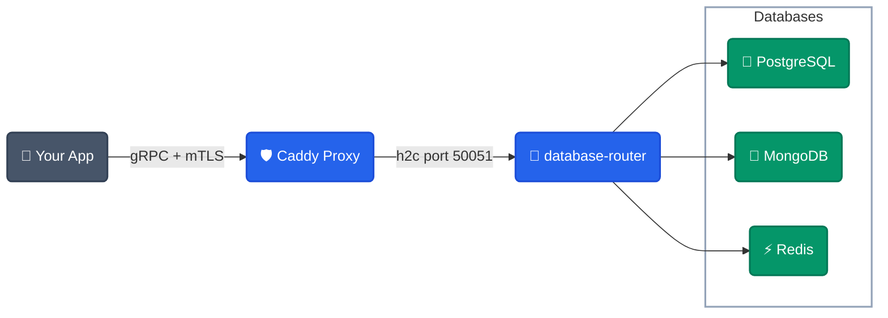

# Database Router


A lightweight, self-hosted **gRPC** server providing a unified interface for PostgreSQL, MongoDB, and Redis. It keeps database credentials out of your application code and routes traffic efficiently and securely.

## 💡 Why use Database Router?

| Feature                 | Traditional DB Connection               | Database Router                                          |
| ----------------------- | --------------------------------------- | -------------------------------------------------------- |
| **Credentials**   | Stored in every app's code/env          | Centralized; apps never hold database passwords          |
| **Security**      | App directly accesses database ports    | Only one secure, mTLS-enforced gRPC interface is exposed |
| **Communication** | Assorted, DB-specific language drivers  | Strongly typed, auto-generated gRPC clients              |
| **Performance**   | App-side connection pooling overhead    | Multiplexed HTTP/2 with efficient Protobuf encoding      |
| **Platform Ops**  | Manual network routing and proxy config | Automated, production-grade cloud deployer included      |

### 👥 Who Benefits?

- **Startups:** Avoid DevOps headaches with automated deployment.
- **Security Teams:** Enforce mTLS and centralize credentials.
- **Backend Engineers:** Reduce boilerplate code with typed gRPC clients.
- **DevOps Teams:** Automate infrastructure and reduce manual setup.

---

## 🔌 Client Libraries

We provide two tiers of client libraries across **4 languages**:

### SDK — Low-Level gRPC Clients

Direct access to all gRPC service stubs. You manage certificate loading and database targeting yourself.

| Language | Package | Install |
|----------|---------|---------|
| **Python** | [`xeze-dbr`](https://pypi.org/project/xeze-dbr/) | `pip install xeze-dbr` |
| **Node.js** | [`@xeze/dbr`](https://www.npmjs.com/package/@xeze/dbr) | `npm install @xeze/dbr` |
| **Rust** | [`xeze-dbr`](https://crates.io/crates/xeze-dbr) | `cargo add xeze-dbr` |
| **Go** | `code.xeze.org/xeze/Database-Router/sdk/go` | `go get code.xeze.org/xeze/Database-Router/sdk/go` |

### Core — High-Level Vault Wrappers

One-line setup with automatic Vault mTLS auth and database-per-service isolation via `app_namespace`. This is what most developers should use.

| Language | Package | Install |
|----------|---------|---------|
| **Python** | [`xeze-dbr-core`](https://pypi.org/project/xeze-dbr-core/) | `pip install xeze-dbr-core` |
| **Node.js** | [`@xeze/dbr-core`](https://www.npmjs.com/package/@xeze/dbr-core) | `npm install @xeze/dbr-core` |
| **Rust** | [`xeze-dbr-core`](https://crates.io/crates/xeze-dbr-core) | `cargo add xeze-dbr-core` |
| **Go** | `code.xeze.org/xeze/Database-Router/core/go` | `go get code.xeze.org/xeze/Database-Router/core/go` |

### SDK vs Core — Which One?

| | SDK (`sdk/`) | Core (`core/`) |
|---|---|---|
| **Level** | Low-level gRPC stubs | High-level abstraction |
| **Auth** | Manual cert loading | Automatic via HashiCorp Vault |
| **Isolation** | None — raw access | Enforced namespace per service |
| **Data format** | Protobuf messages | Native language types (dicts, maps, objects) |
| **Use case** | Custom tooling, infra scripts | Application development |

### Quick Example (Core — Python)

```python
from xeze_core import XezeCoreClient

db = XezeCoreClient(app_namespace="myapp")
db.init_workspace()

# Postgres — native Python dicts
db.pg_insert("users", {"name": "Ayush", "role": "admin"})
rows = db.pg_query("SELECT * FROM users")

# MongoDB
db.mongo_insert("logs", {"action": "user_created"})

# Redis
db.redis_set("session:abc", "user_123", ttl=300)
val = db.redis_get("session:abc")  # "user_123"
```

### 🔐 Certificate Management

Our SDKs provide native dual-support for establishing secure mTLS connections:

1. **Dynamic Secrets Management (Recommended):** Fetch certificates dynamically from **HashiCorp Vault** at runtime. Private keys remain strictly in memory — never written to disk.
2. **Static Certificate Files:** Standard support for loading `.crt` and `.key` files from your application's file system.

---

## 📋 Requirements

Before deploying the Database Router to production, ensure you have the following prerequisites ready:

- **Docker & Docker Compose**: Must be installed on your local system or deployment server.
- **Domain Name**: You must have a registered domain name (e.g., `example.com`).
- **Cloud Provider Name Servers**: The name servers for your domain **must** be managed by your cloud provider (e.g., DigitalOcean, Hetzner, Cloudflare). This is required for automatic DNS management and Let's Encrypt / mTLS certificate generation.
- **Provider API Token**: You must have a valid API token from your cloud provider to allow Terraform and Ansible to automatically provision and configure your infrastructure.

---

## 🚀 Quick Start (Cloud Deployment)

The fastest way to deploy the entire stack to the cloud is using our automated deployer. We currently support **DigitalOcean** and **Hetzner Cloud** out of the box.

### Option 1: DigitalOcean

**Mac / Linux:**

```bash
cd deployer
DIGITALOCEAN_TOKEN="your_token_here" docker compose up -d
```

**Windows (PowerShell):**

```powershell
cd deployer
$env:DIGITALOCEAN_TOKEN="your_token_here"; docker compose up -d
```

### Option 2: Hetzner Cloud

**Mac / Linux:**

```bash
cd deployer
HCLOUD_TOKEN="your_token_here" docker compose up -d
```

**Windows (PowerShell):**

```powershell
cd deployer
$env:HCLOUD_TOKEN="your_token_here"; docker compose up -d
```

---

## 🏗️ Architecture



---

## 📂 Project Structure

```
Database-Router/
├── cmd/              # Go server entrypoint
├── internal/         # Core router logic (Go)
├── proto/            # Protobuf definitions (source of truth)
├── sdk/              # Low-level gRPC client libraries
│   ├── python/       #   pip install xeze-dbr
│   ├── node/         #   npm install @xeze/dbr
│   ├── rust/         #   cargo add xeze-dbr
│   └── go/           #   go get .../sdk/go
├── core/             # High-level Vault-integrated wrappers
│   ├── python/       #   pip install xeze-dbr-core
│   ├── node/         #   npm install @xeze/dbr-core
│   ├── rust/         #   cargo add xeze-dbr-core
│   └── go/           #   go get .../core/go
├── examples/         # Demo apps and playground
├── deployer/         # One-command cloud deployer
├── terraform/        # Infrastructure provisioning
├── ansible/          # Server configuration automation
├── certs/            # TLS certificate generation scripts
└── docs/             # API reference and guides
```

---

## 🛡️ Security & Authentication

While the core router is lightweight and delegates security to the infrastructure layer, **our automated cloud deployment is production-grade out of the box.**

The included Terraform and Ansible automation automatically secures your deployment via the provided `Caddyfile`:

- **Caddy Reverse Proxy**: Serves exclusively over port `443` and safely proxies gRPC traffic over unencrypted HTTP/2 (`h2c://`) directly to the isolated `db-router` container.
- **Strict mTLS Enforcement**: Uses `require_and_verify` client authentication. Only applications presenting a valid TLS certificate signed by your trusted Certificate Authority (`ca.crt`) are permitted to connect.
- **Network Isolation**: Cloud firewalls are configured to ensure port `50051` is tightly locked down and never exposed directly to the public internet.

---

## 📚 Documentation & Automation

Detailed guides and automation playbooks are included in the repository:

- **[gRPC API Reference](docs/api.md)** — Full RPC definitions for PostgreSQL, MongoDB, and Redis services.
- **[Configuration](docs/config.md)** — Explanations of all JSON config fields and environment variables.
- **[mTLS Guide](docs/mtls-guide.md)** — Instructions on certificate generation and mTLS setup.
- **[Terraform Infrastructure](terraform/)** — One-command cloud infrastructure provisioning.
- **[Ansible Setup](ansible/)** — Automated server configuration, proxy setup, and mTLS enforcement.
- **[Deployer](deployer/)** — A fully automated container to deploy everything with a single `docker run` command.

---

## 📄 License

Apache 2.0
