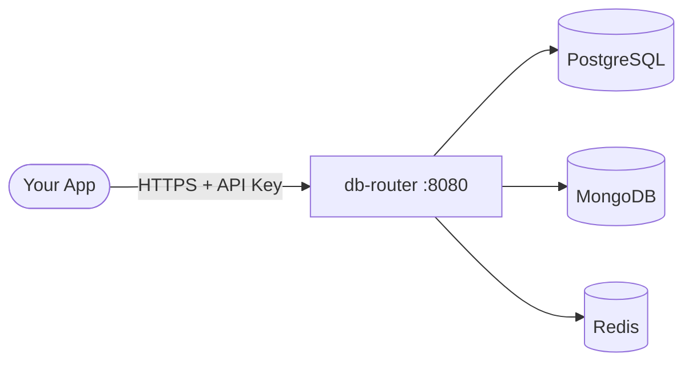
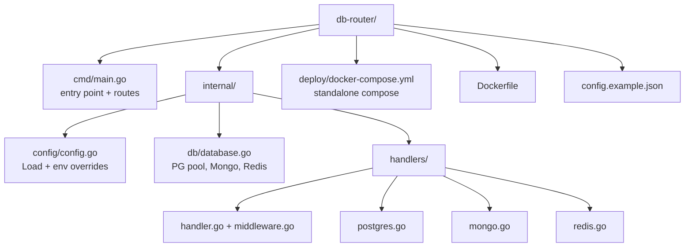

# database-router

A lightweight, self-hosted REST API that gives any application a single HTTPS endpoint to talk to PostgreSQL, MongoDB, and Redis. No direct database credentials in your app code.

---

## How it works



You mount one `config.json` with your credentials, run the container, and every other service talks HTTP. Rotate credentials by editing one file and restarting the container.

---

## Quick start

**1. Copy the config template**
```bash
cp config.example.json config.json
# edit config.json with your database credentials
```

**2. Run with Docker**
```bash
docker run -d \
  -p 8080:8080 \
  -v $(pwd)/config.json:/app/config.json:ro \
  --name db-router \
  ghcr.io/xeze-org/database-router:latest
```

Or with Compose:
```bash
docker compose -f deploy/docker-compose.yml up -d
```

**3. Test it**
```bash
curl http://localhost:8080/health
curl -H "X-API-Key: your-key" http://localhost:8080/api/v1/test/all
```

---

## Running from source

**Requirements:** Go 1.21+

```bash
git clone https://github.com/xeze-org/database-router
cd db-router

# Windows
start.bat

# Linux / macOS
go mod download
go build -o database-router ./cmd/
./databaseb-router
```

Default port is `8080`. Override with `PORT=9090 ./db-router`.

---

## Configuration

Config is loaded from `config.json` in the working directory.
**Do not commit this file** -- it is in `.gitignore`. Use `config.example.json` as your template.

See [docs/config.md](docs/config.md) for the full field reference and environment variable overrides.

---

## API

All routes are under `/api/v1`. Authentication is handled by your reverse proxy (Caddy, nginx, etc.) -- not built into the router itself.

| Group | Endpoints |
|---|---|
| Health | `GET /health` |
| Tests | `GET /api/v1/test/all`, `/test/postgres`, `/test/mongo`, `/test/redis` |
| PostgreSQL | databases, tables, select, insert, update, delete, raw query |
| MongoDB | databases, collections, find, insert, update, delete |
| Redis | keys, get, set, delete, info |

Full endpoint reference: [docs/api.md](docs/api.md)

---

## Example calls

```bash
BASE="https://your-domain.com"
KEY="your-api-key"

# test all connections
curl -H "X-API-Key: $KEY" $BASE/api/v1/test/all

# list tables
curl -H "X-API-Key: $KEY" $BASE/api/v1/postgres/tables/mydb

# insert a row
curl -X POST -H "X-API-Key: $KEY" -H "Content-Type: application/json" \
  -d '{"name":"Alice","email":"alice@example.com"}' \
  $BASE/api/v1/postgres/insert/mydb/users

# redis set with TTL
curl -X POST -H "X-API-Key: $KEY" -H "Content-Type: application/json" \
  -d '{"key":"session:abc","value":"user:42","ttl":3600}' \
  $BASE/api/v1/redis/set
```

---

## Project structure



---

## Docs

- [docs/api.md](docs/api.md) -- full endpoint reference
- [docs/config.md](docs/config.md) -- all config fields and env vars
- [docs/deployment.md](docs/deployment.md) -- Docker, source, reverse proxy setup

---

## Docker image

The image contains **zero credentials**. Config is always supplied at runtime via a volume mount.

Build and push is **manual only** -- go to **Actions -> Build & Publish Docker Image -> Run workflow**.

**Architectures:** `linux/amd64`, `linux/arm64`

---

## License

MIT
