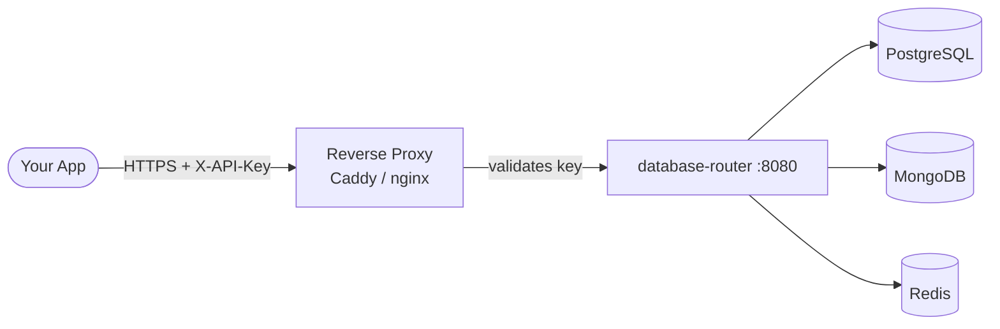
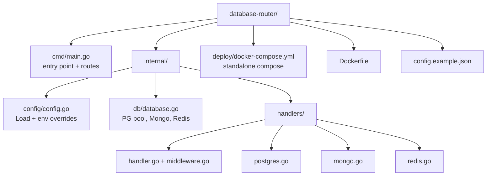

# database-router


A lightweight, self-hosted REST API that exposes a **single HTTPS endpoint** for PostgreSQL, MongoDB, and Redis. No direct database credentials in your app code.

---

## Why this over PostgREST / Hasura?

| | database-router | PostgREST | Hasura |
|---|---|---|---|
| Multi-database (PG + Mongo + Redis) | yes | PostgreSQL only | PostgreSQL / MS SQL |
| Zero external dependencies | yes (single binary) | no | no |
| Config via one JSON file | yes | env vars + config | env vars + metadata |
| Self-hostable, air-gapped | yes | yes | complex |

Use `database-router` when you want **one unified API** in front of all three database types without running a heavyweight data layer.

---

## How it works



Authentication is enforced by the **reverse proxy**, not by the router itself. The router trusts all traffic that reaches it on port 8080 — keep it off the public internet (see [Security](#security)).

---

## Quick start

**1. Copy the config template**
```bash
cp config.example.json config.json
# fill in your database host, user, password
```

**2. Run with Docker**
```bash
docker run -d \
  -p 8080:8080 \
  -v $(pwd)/config.json:/app/config.json:ro \
  --name database-router \
  ghcr.io/xeze-org/database-router:latest
```

Or with Compose:
```bash
docker compose -f deploy/docker-compose.yml up -d
```

**3. Test it**
```bash
curl http://localhost:8080/health
curl http://localhost:8080/api/v1/test/all
```

---

## Running from source

**Requirements:** Go 1.21+

```bash
git clone https://github.com/Xeze-org/Database-Router
cd Database-Router

# Windows
start.bat

# Linux / macOS
go mod download
go build -o database-router ./cmd/
./database-router
```

Default port is `8080`. Override with `PORT=9090 ./database-router`.

---

## Configuration

Config is loaded from `config.json` in the working directory.
**Do not commit this file** -- it is in `.gitignore`. Use `config.example.json` as your template.

See [docs/config.md](docs/config.md) for the full field reference and environment variable overrides.

---

## Authentication

`database-router` has **no built-in authentication**. All traffic reaching port 8080 is trusted.

Protect it by putting a reverse proxy in front that validates a secret header before forwarding the request:

```caddy
database-router.yourdomain.com {
    @noauth {
        not header X-API-Key your-secret-key
        not path /health
    }
    respond @noauth 401

    reverse_proxy localhost:8080
}
```

With this setup, callers include `-H "X-API-Key: your-secret-key"` in every request. The key is checked by Caddy; the router never sees or validates it.

> Never expose port 8080 directly to the internet. Always route traffic through the reverse proxy.

---

## API

All routes are under `/api/v1`.

| Group | Endpoints |
|---|---|
| Health | `GET /health` |
| Tests | `GET /api/v1/test/all`, `/test/postgres`, `/test/mongo`, `/test/redis` |
| PostgreSQL | databases, tables, select, insert, update, delete, raw query |
| MongoDB | databases, collections, find, insert, update, delete |
| Redis | keys, get, set, delete, info |

Full endpoint reference: [docs/api.md](docs/api.md)

---

## Example calls

These examples assume you have a reverse proxy enforcing `X-API-Key`.

```bash
BASE="https://your-domain.com"
KEY="your-api-key"

# test all connections
curl -H "X-API-Key: $KEY" $BASE/api/v1/test/all

# list tables
curl -H "X-API-Key: $KEY" $BASE/api/v1/postgres/tables/mydb

# insert a row
curl -X POST -H "X-API-Key: $KEY" -H "Content-Type: application/json" \
  -d '{"name":"Alice","email":"alice@example.com"}' \
  $BASE/api/v1/postgres/insert/mydb/users

# redis set with TTL
curl -X POST -H "X-API-Key: $KEY" -H "Content-Type: application/json" \
  -d '{"key":"session:abc","value":"user:42","ttl":3600}' \
  $BASE/api/v1/redis/set
```

---

## Security

> **This router is designed for internal networks and trusted microservice environments only.**

Key risks to understand before deploying:

- **Raw SQL endpoint** -- `POST /api/v1/postgres/query` executes arbitrary SQL. Never pass user-supplied input directly to this endpoint. It is intended for internal tooling and admin scripts, not for serving end-user requests.
- **No built-in auth** -- If port 8080 is reachable without a reverse proxy, every database operation is unauthenticated. Always firewall the port and route through a proxy.
- **NoSQL injection** -- MongoDB filter params and Redis keys should be validated in your application before being forwarded to the router.
- **Credentials** -- `config.json` holds database passwords in plaintext. Use `0600` permissions, never commit it, and prefer environment variable overrides in CI/CD environments.

**Recommended deployment:**
```
Internet → Caddy (TLS + API key check) → database-router (internal only, port 8080)
```

---

## Project structure



---

## Docs

- [docs/api.md](docs/api.md) -- full endpoint reference
- [docs/config.md](docs/config.md) -- all config fields and env vars
- [docs/deployment.md](docs/deployment.md) -- Docker, source, reverse proxy setup

---

## Docker image

The image contains **zero credentials**. Config is always supplied at runtime via a volume mount.

Build and push is **manual only** -- go to **Actions -> Build & Publish Docker Image -> Run workflow**.

**Architectures:** `linux/amd64`, `linux/arm64`

---

## License

MIT