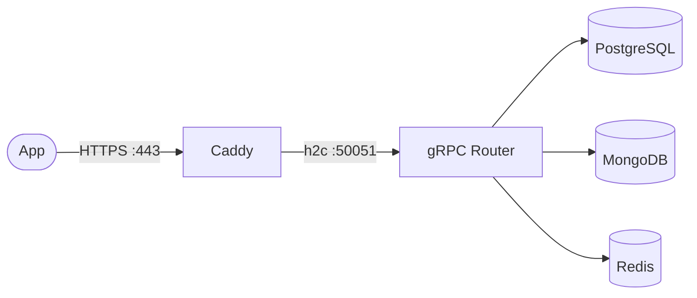

# db-router — Ansible

Configure and deploy the full db-router stack on a Debian/Ubuntu server.

```
ansible-playbook playbook.yml
```



---

## What gets installed

| Role | What it does |
|---|---|
| **docker** | Installs Docker CE + Compose plugin from Docker's official repo |
| **dbrouter** | Clones repo, templates `.env` + `config.json`, generates mTLS certs (optional), runs `docker compose up` |
| **caddy** | Installs Caddy from official repo, deploys a Caddyfile with auto-HTTPS reverse proxy |

---

## Prerequisites

- A server running Debian 12+ or Ubuntu 22.04+
- SSH access as root (or a sudo user)
- Ansible 2.14+ on your local machine
- A domain pointing to the server IP (for Caddy auto-HTTPS)

---

## Quick start

### 1. Edit inventory

```ini
# ansible/inventory.ini
[dbrouter]
db.0.xeze.org ansible_user=root
```

### 2. Set credentials

Edit `group_vars/dbrouter.yml`:

```yaml
domain: "db.0.xeze.org"
postgres_password: "your-strong-password"
mongo_password: "your-strong-password"
redis_password: "your-strong-password"
caddy_email: "you@example.com"
```

Or use Ansible Vault:

```bash
ansible-vault encrypt group_vars/dbrouter.yml
ansible-playbook playbook.yml --ask-vault-pass
```

### 3. Run

```bash
cd ansible
ansible-playbook playbook.yml
```

### 4. Verify

```bash
# gRPC (through Caddy mTLS termination)
grpcurl \
  -cacert certs/ca.crt \
  -cert   certs/client.crt \
  -key    certs/client.key \
  db.0.xeze.org:443 dbrouter.HealthService/Check
```

---

## Roles

### `docker`

- Adds Docker's official GPG key and apt repo
- Installs `docker-ce`, `docker-ce-cli`, `containerd.io`, `docker-compose-plugin`
- Enables and starts the Docker service
- Installs Python Docker SDK (for Ansible's docker modules)

### `dbrouter`

- Clones the db-router repo to `/opt/db-router`
- Templates `.env` (Docker Compose credentials) and `config.json` (router config)
- Generates mTLS certificates if `enable_mtls: true`
- Runs `docker compose up` (PostgreSQL, MongoDB, Redis, gRPC router)
- Waits for the gRPC port to be ready

### `caddy`

- Installs Caddy from the official Cloudsmith repo
- Templates a Caddyfile:
  - `{{ domain }}` → reverse proxy h2c to gRPC (:50051) with mTLS
- Caddy auto-obtains Let's Encrypt TLS certificates
- Validates Caddyfile before reloading

---

## Variables

| Variable | Default | Description |
|---|---|---|
| `domain` | `db.0.xeze.org` | Primary domain for the server |
| `grpc_port` | `50051` | gRPC server port (internal) |
| `postgres_user` | `admin` | PostgreSQL username |
| `postgres_password` | `CHANGE_ME` | PostgreSQL password |
| `postgres_db` | `unified_db` | Default PostgreSQL database |
| `mongo_user` | `admin` | MongoDB username |
| `mongo_password` | `CHANGE_ME` | MongoDB password |
| `redis_password` | `CHANGE_ME` | Redis password |
| `enable_mtls` | `false` | Generate and enable mTLS on gRPC |
| `caddy_email` | `admin@xeze.org` | Email for Let's Encrypt registration |

---

## Caddy endpoints

After deployment, Caddy provides automatic HTTPS:

| URL | Backend | Description |
|---|---|---|
| `https://db.0.xeze.org` | `h2c://localhost:50051` | gRPC (mTLS terminated by Caddy) |

No ports other than 80 and 443 need to be public — Caddy handles everything.

---

## Rerunning

Ansible is idempotent — safe to rerun:

```bash
# Full deploy
ansible-playbook playbook.yml

# Only update config (skip Docker install)
ansible-playbook playbook.yml --tags dbrouter

# Only update Caddy config
ansible-playbook playbook.yml --tags caddy
```

---

## File structure

```
ansible/
├── ansible.cfg                     ← Ansible configuration
├── inventory.ini                   ← Target hosts
├── playbook.yml                    ← Main playbook
├── group_vars/
│   └── dbrouter.yml                ← All variables (credentials, domain, ports)
├── roles/
│   ├── docker/
│   │   └── tasks/main.yml          ← Install Docker + Compose
│   ├── dbrouter/
│   │   ├── tasks/main.yml          ← Clone, config, certs, compose up
│   │   ├── handlers/main.yml       ← Restart on config change
│   │   └── templates/
│   │       ├── config.json.j2      ← db-router config template
│   │       └── env.j2              ← Docker Compose .env template
│   └── caddy/
│       ├── tasks/main.yml          ← Install Caddy, deploy Caddyfile
│       ├── handlers/main.yml       ← Reload on config change
│       └── templates/
│           └── Caddyfile.j2        ← Reverse proxy config template
└── README.md                       ← This file
```
