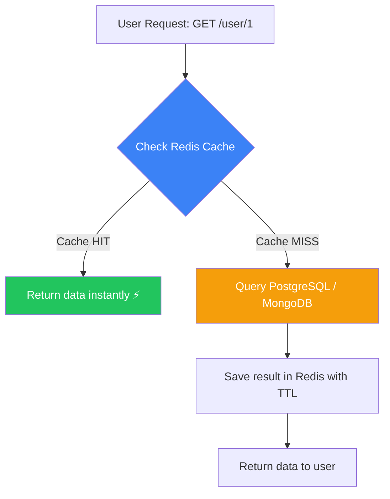
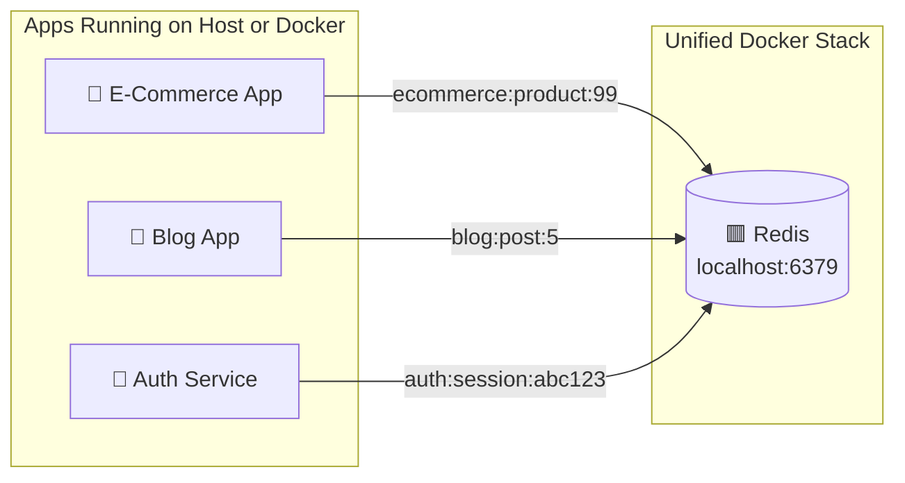
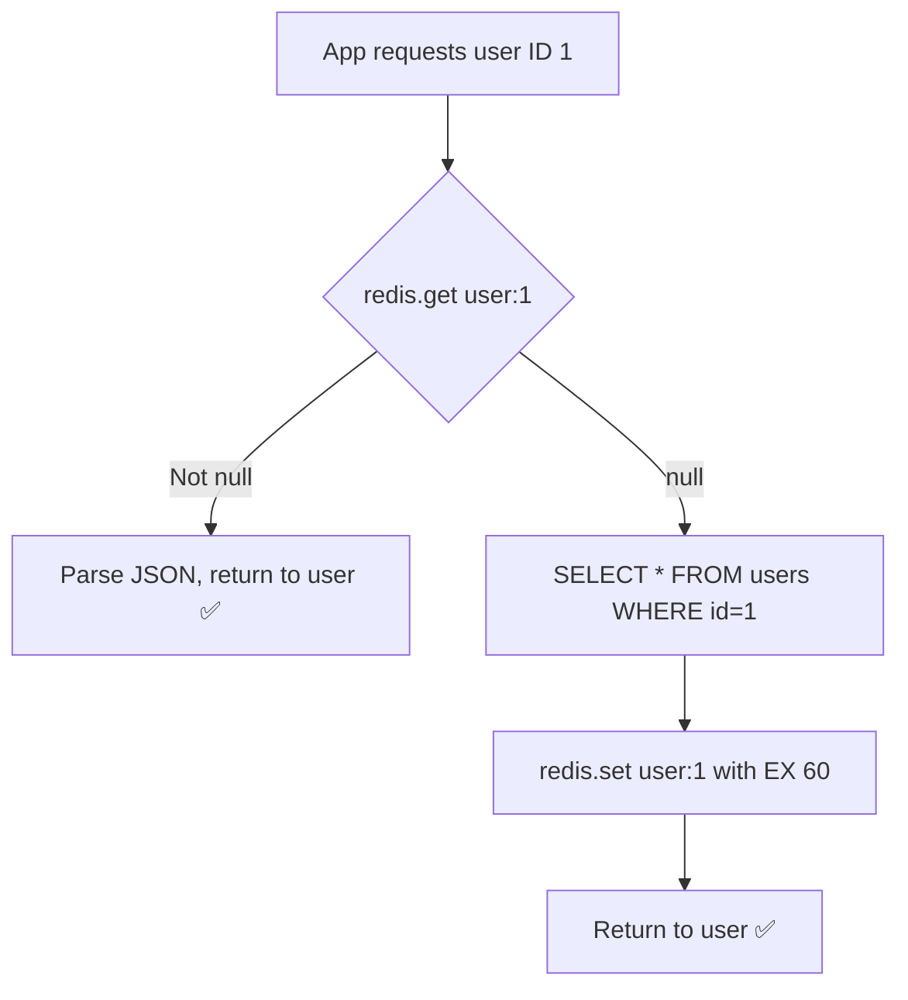

# Redis Complete Guide

Redis is an **in-memory data store** used as a cache, session store, and message broker. It stores data in RAM, making reads/writes significantly faster than disk-based databases like PostgreSQL or MongoDB.

---

## 1. What is Redis and Why Use It?

| Feature | PostgreSQL / MongoDB | Redis |
|---|---|---|
| Storage | Disk (slow) | RAM (ultra fast) |
| Speed | ~5–50ms per query | ~0.1ms per operation |
| Data Types | Tables / Documents | Strings, Lists, Sets, Hashes |
| Best For | Persistent data | Temporary, frequently accessed data |

---

## 2. How Redis Speeds Up Your App

### Cache-Aside Pattern (Most Common)



**TTL (Time To Live)** — You set an expiry on cached data (e.g., 60 seconds) so stale data gets auto-deleted.

---

## 3. Multi-App Architecture with One Redis

All your apps connect to the same Redis container. No conflicts happen as long as you use proper key naming.



Each app uses its own **key prefix** to keep data completely isolated inside the same Redis instance.

---

## 4. Key Naming Convention (The Standard)

**Format:** `appname:entity:id`

```
ecommerce:user:1          → cached user profile
ecommerce:product:99      → cached product details
blog:post:42              → cached blog post
blog:comments:42          → cached comments for post 42
auth:session:abc123       → user session token
auth:ratelimit:192.168.1.1 → rate limit counter per IP
```

> ✅ Use this over Redis DB numbers (0–15). It is the industry standard for production apps.

---

## 5. Connecting Redis to Your App

### Node.js
```bash
npm install ioredis
```
```javascript
const Redis = require("ioredis");

const redis = new Redis({
  host: "localhost",      // use "redis" if app is inside Docker
  port: 6379,
  password: "p9Kj2mT7vWcD4s8X"
});

// --- Write ---
// Cache user for 60 seconds
await redis.set("ecommerce:user:1", JSON.stringify({ name: "Ayush" }), "EX", 60);

// --- Read ---
const cached = await redis.get("ecommerce:user:1");
const user = JSON.parse(cached);

// --- Delete ---
await redis.del("ecommerce:user:1");
```

### Python
```bash
pip install redis
```
```python
import redis, json

r = redis.Redis(
    host="localhost",   # use "redis" if app is inside Docker
    port=6379,
    password="p9Kj2mT7vWcD4s8X",
    decode_responses=True
)

# Write (cache for 60 seconds)
r.set("blog:post:42", json.dumps({"title": "Hello World"}), ex=60)

# Read
post = json.loads(r.get("blog:post:42"))

# Delete
r.delete("blog:post:42")
```

---

## 6. Real-World Caching Pattern (With Code)



**Node.js Example:**
```javascript
async function getUser(id) {
  const cacheKey = `ecommerce:user:${id}`;

  // 1. Check Redis
  const cached = await redis.get(cacheKey);
  if (cached) return JSON.parse(cached); // Cache HIT ⚡

  // 2. Query DB on Cache MISS
  const user = await db.query("SELECT * FROM users WHERE id = $1", [id]);

  // 3. Store in Redis for 60 seconds
  await redis.set(cacheKey, JSON.stringify(user), "EX", 60);

  return user;
}
```

---

## 7. Common Redis Data Types

| Type | Use Case | Example Command |
|---|---|---|
| **String** | Cache single values | `SET key value EX 60` |
| **Hash** | Cache objects with fields | `HSET user:1 name "Ayush" age 25` |
| **List** | Queues / activity feeds | `LPUSH notifications "msg"` |
| **Set** | Unique values (tags, followers) | `SADD user:1:followers 42` |
| **Sorted Set** | Leaderboards / rankings | `ZADD leaderboard 1500 "Ayush"` |

---

## 8. Session Storage (Auth Use Case)

Redis is perfect for storing login sessions — fast, and auto-expires when the session TTL runs out.

```javascript
// On Login: Store session
const sessionId = "abc123-random-token";
await redis.set(`auth:session:${sessionId}`, JSON.stringify({ userId: 1, role: "admin" }), "EX", 86400); // 1 day

// On Each Request: Verify session
const session = await redis.get(`auth:session:${sessionId}`);
if (!session) return res.status(401).json({ error: "Session expired" });
```

---

## 9. Your Connection Details

> Keep these secure. They are in your `.env` file.

| Property | Value |
|---|---|
| Host (Windows) | `localhost` |
| Host (Inside Docker) | `redis` |
| Port | `6379` |
| Password | See `.env` → `REDIS_PASSWORD` |
