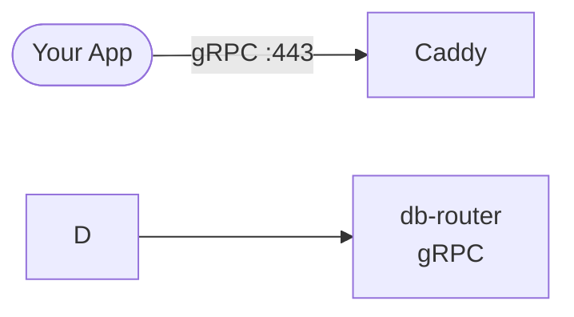

# db-router — Terraform (DigitalOcean)

Deploy the full db-router stack (PostgreSQL + MongoDB + Redis + gRPC router) on a single DigitalOcean droplet.

> **Prefer the automated deployer?** See [deployer/](../deployer/) — one `docker run` handles Terraform + Ansible end-to-end with zero manual steps.



---

## Prerequisites

- [Terraform](https://developer.hashicorp.com/terraform/install) >= 1.5
- A [DigitalOcean](https://www.digitalocean.com/) account + API token
- An SSH key uploaded to your DO account **or** use the deployer container (auto-generates one)
- A domain managed in DO DNS (or point your registrar's NS to DO)

---

## Quick start

### 1. Set your DO token

```powershell
# Windows PowerShell
$env:DIGITALOCEAN_TOKEN = "dop_v1_xxxxxxxxxxxxxxxx"
```

```bash
# Linux / macOS
export DIGITALOCEAN_TOKEN="dop_v1_xxxxxxxxxxxxxxxx"
```

### 2. Create your tfvars

```bash
cp terraform.tfvars.example terraform.tfvars
# Edit terraform.tfvars — set allowed_ips, domain, etc.
```

### 3. Deploy

```bash
cd terraform
terraform init
terraform plan
terraform apply
```

Terraform creates the droplet, firewall, and DNS record. Then run [Ansible](../ansible/) to configure the server, or use the [deployer container](../deployer/) which does both automatically.

### 4. Verify

```bash
# SSH in
ssh root@$(terraform output -raw droplet_ip)

# Check containers
docker ps

# Test gRPC (via Caddy mTLS)
grpcurl \
  -cacert certs/ca.crt \
  -cert   certs/client.crt \
  -key    certs/client.key \
  $(terraform output -raw fqdn):443 dbrouter.HealthService/Check
```

---

## What gets deployed

| Component | Details |
|---|---|
| **Droplet** | Debian 13, provisioned by Ansible (Docker, Caddy, app) |
| **PostgreSQL** | `postgres:16` container, port 5432 (localhost only) |
| **MongoDB** | `mongo:latest` container, port 27017 (localhost only) |
| **Redis** | `redis:7-alpine` container, port 6379 (localhost only) |
| **db-router** | gRPC server on `:50051` (internal, fronted by Caddy) |
| **Caddy** | Reverse proxy with auto-HTTPS (Let's Encrypt) on ports 80/443, enforces mTLS |
| **Firewall** | SSH restricted to `allowed_ips`; HTTP/HTTPS open for Caddy; gRPC direct port restricted |

---

## Variables

| Variable | Default | Description |
|---|---|---|
| `droplet_name` | `db-router` | Droplet name |
| `region` | `blr1` | DO region |
| `droplet_size` | `s-1vcpu-2gb` | Size slug |
| `image` | `debian-13-x64` | OS image |
| `ssh_key_name` | `ayush` | DO SSH key name (used when `ssh_public_key` is empty) |
| `ssh_public_key` | `""` | Public key content (set by deployer container; leave empty for manual use) |
| `domain` | `0.xeze.org` | Base domain |
| `subdomain` | `db` | Subdomain (→ `db.0.xeze.org`) |
| `postgres_user` | `admin` | PG username |
| `postgres_db` | `unified_db` | Default PG database |
| `mongo_user` | `admin` | Mongo username |
| `allowed_ips` | `["0.0.0.0/0"]` | CIDRs allowed to reach SSH/gRPC — **set to your IP!** |
| `grpc_port` | `50051` | gRPC port |
| `enable_mtls` | `true` | Generate mTLS certs and enable on the gRPC server |

> **Passwords are auto-generated** — no need to set them manually. See Outputs below.

---

## Outputs

| Output | Sensitive | Example |
|---|---|---|
| `droplet_ip` | no | `139.59.12.34` |
| `fqdn` | no | `db.0.xeze.org` |
| `grpc_endpoint` | no | `db.0.xeze.org:50051` |
| `redis_password` | **yes** | (auto-generated 24-char) |

### Viewing passwords after deploy

```bash
# Show one password
terraform output postgres_password

# Show all credentials in a nice box
terraform output credentials_summary

# Machine-readable JSON (all outputs including secrets)
terraform output -json
```

---

## mTLS

Set `enable_mtls = true` in `terraform.tfvars` to automatically generate
CA + server + client certificates during bootstrap. Certificates are written
to `/opt/db-router/certs/` on the droplet.

After deploy, copy the client cert to your local machine:

```bash
scp root@$(terraform output -raw droplet_ip):/opt/db-router/certs/client.crt ./certs/
scp root@$(terraform output -raw droplet_ip):/opt/db-router/certs/client.key ./certs/
scp root@$(terraform output -raw droplet_ip):/opt/db-router/certs/ca.crt ./certs/
```

Then connect with mTLS:

```bash
grpcurl \
  -cacert certs/ca.crt \
  -cert   certs/client.crt \
  -key    certs/client.key \
  $(terraform output -raw grpc_endpoint) dbrouter.HealthService/Check
```

See [docs/mtls-guide.md](../docs/mtls-guide.md) for a full certificate walkthrough.

---

## Security hardening (production)

1. **Set `allowed_ips`**: restrict to your IP / office CIDR — `allowed_ips = ["203.0.113.5/32"]`
2. **Close direct ports**: remove the gRPC inbound rules in `firewall.tf` if you only access via Caddy
3. **Enable mTLS**: `enable_mtls = true` — only clients with a signed cert can connect
4. **Remote state**: add a `backend "s3" {}` or DO Spaces backend for team usage

---

## Destroy

```bash
terraform destroy
```

---

## File structure

```
terraform/
├── provider.tf              ← DO provider + version pins
├── variables.tf             ← all configurable inputs
├── ssh.tf                   ← hybrid SSH key (generated or existing)
├── main.tf                  ← droplet resource
├── secrets.tf               ← auto-generated passwords
├── firewall.tf              ← inbound/outbound rules (80/443 open, rest restricted)
├── dns.tf                   ← A record for the domain
├── output.tf                ← IP, FQDN, credentials
├── terraform.tfvars.example ← template (copy → terraform.tfvars)
├── .gitignore               ← excludes state, tfvars, .terraform/
└── README.md                ← this file
```
